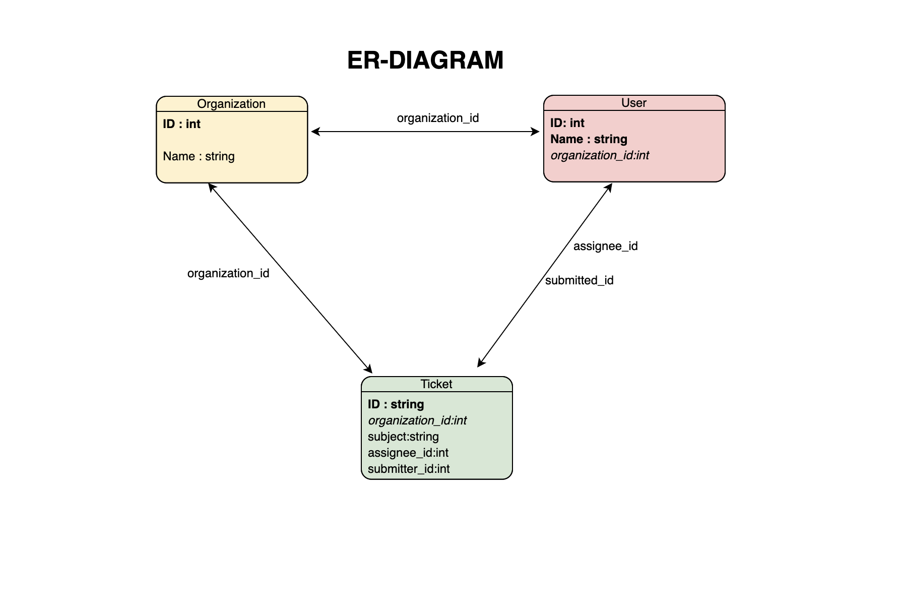

# Zendesk_quiz

Description:

This is a simple app on CLI for json key value search

The script was written in Python3.6, with two standard modules named os and json

-------------------------------------------------------------------------------------------------

Data entity relationship analysis:

After json key,value validation, the relationships between three files are quite straightforward.

Althogh there are empty entry for certain keys in each file, most of the fields could be connected with the relation in the diagram

each `_id` field in each file is unique, which could be considered as the primary key.

--------------------------------------------------------------------------------------------------

Demo description:

In order to minize the output of related fields, I decided to put more readable entry to represent the relations

EXAMPLE:

when searching with `users`, whenever there is a match, it will return all the entris of `user` , `organization_name` , `subject` in a list when multiple entries for this user as a submitter or as an assignee.

when searching with `organizations`, it will deliver all `user name` of this org as well as all the ticket `subject` of this organization.

when searching with `tickets`, this will fill the `organization_name` as well as the `name` of both `submitter` and `assginee`.

This app also supports one-to-many matches.

EXAMPLE:

when searching with entities that have common values such as `active` and `status`, it will return all the matching results.

Apart from this, when if there is no such entity in the record, this will also give feedback when the value for that entity is empty.

EXAMPLE:

when searching for `timezone` that does not exist in some of the records, as long as the input for value is empty (a simple enter, or multiple whitespaces).

--------------------------------------------------------------------------------------------------

User Instruction:

1)Clone the file to local laptop

2)Make sure three json files are in the same directory as well as python3 is installed

3)Open terminal on Mac or Linux, run `cd <the directory of this .py file>`

4)Run `python3 Zendesk.py`

5)Follow the instruction in the app

6)The search for key and value is a full match and case sensitive.
