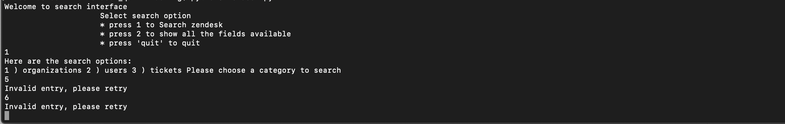
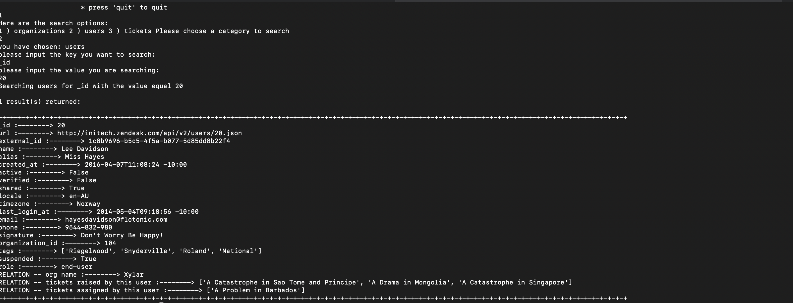
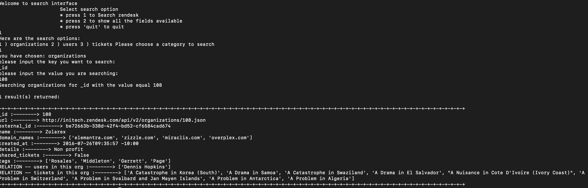
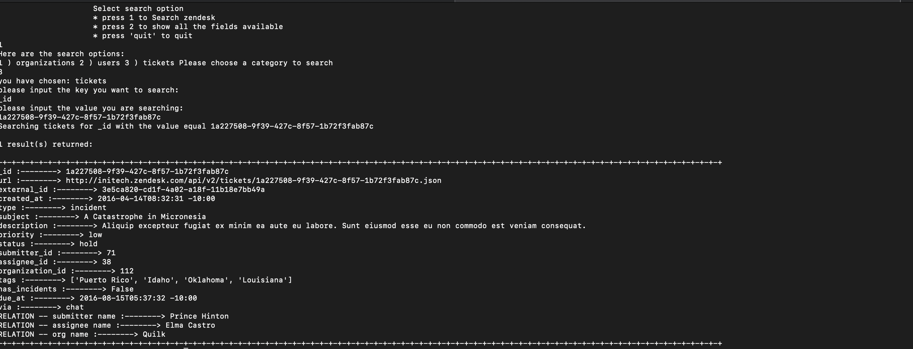
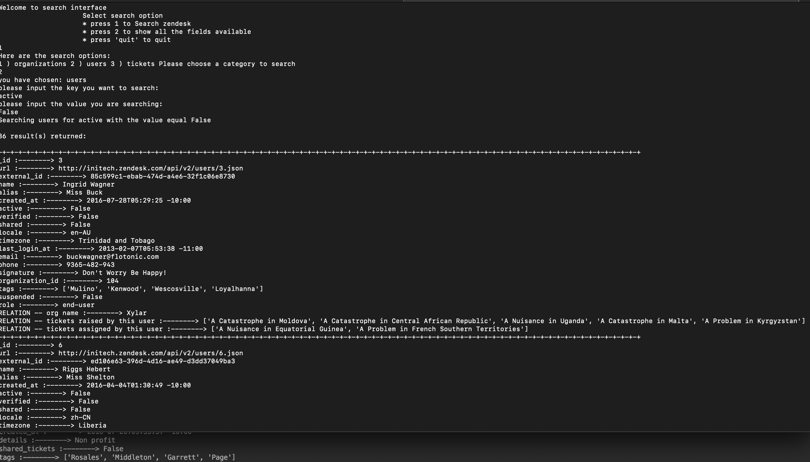
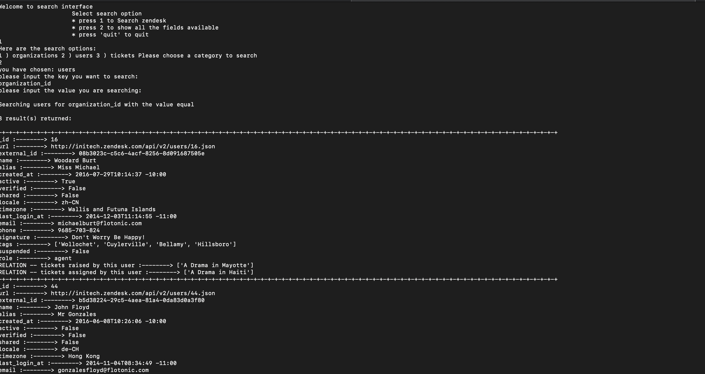

# Zendesk_quiz

Description:

This is a simple app on CLI for json key value search

The script was written in Python3.6, with two standard modules named os and json

-------------------------------------------------------------------------------------------------

Design:

The app was designed as a simple search for individual file.

When searching for certain conditions, it will give all the result including `NONE` result as an object.

If the result is not empty, it will start building the relation between the other two files based on different scenarios, which will get stored in the memory.

All these relations will then be added in that object.

The script was written in one `.py` file simply because it is more readable.

This app consists of a few functions:

fetch_files() is to return a list of all the json files in the current folder in order to make the seaching range wider.

show_terms(), a simple function to give the unique keys in each json.

convert_dict() is a way to convert many-to-one relation lists into a dictionary, which will be hugly convenient when adding related fields into the searching result.

build_relation(), using three methods to put the related fields to the return value based on the searching file option.

search_result(), a simple input matching function.

feedback() is a print out function.

loop such as `for each` and `for k,v in each.items()` is used frequently here. This method will not cause significant searching time latency with the growing size of files because the number of returning records are limited.

-------------------------------------------------------------------------------------------------

Data entity relationship analysis:

After json key,value validation, the relationships between three files are quite straightforward.

Althogh there are empty entry for certain keys in each file, most of the fields could be connected with the relation in the diagram

each `_id` field in each file is unique, which could be considered as the primary key.

--------------------------------------------------------------------------------------------------

Demo description:

a)The script could handle certain kind of errors.

EXAMPLE:

When the files do not exist in the current working directory, it will raise a notice about insufficient number of files.

When the input is not valid, it will fall into a loop until the input meets the requirement,

b)In order to minize the output of related fields, I decided to put more readable entry to represent the relations

EXAMPLE:

when searching with `users`, whenever there is a match, it will return all the entris of `user` , `organization_name` , `subject` in a list when multiple entries for this user as a submitter or as an assignee.

when searching with `organizations`, it will deliver all `user name` of this org as well as all the ticket `subject` of this organization.

when searching with `tickets`, this will fill the `organization_name` as well as the `name` of both `submitter` and `assginee`.

c)This app also supports one-to-many matches.

EXAMPLE:

when searching with entities that have common values such as `active` and `status`, it will return all the matching results.

d)Apart from this, when if there is no such entity in the record, this will also give feedback when the value for that entity is empty.

EXAMPLE:

when searching for `organization_id` that does not exist in some of the records, as long as the input for value is empty (a simple enter, or multiple whitespaces).

--------------------------------------------------------------------------------------------------

User Instruction:

1)Clone the repo to local laptop

2)Make sure three json files are in the same directory as well as python3, together with `json` and `os` modules are installed

open terminal on Mac or Linux, run `python3 --version`

open terminal on Mac or Linux

run `python3`

input `import json` and `import os`, then `print(josn.__version__)` and `print(os.__version__)`

3)Open terminal on Mac or Linux, run `cd <the directory of this .py file>`

4)Run `python3 Zendesk.py`

5)Follow the instruction in the app

6)The search for key and value is a full match and case sensitive.

------------------------------------------------------------------------------------------------

Limitation:

1)When searching for Boolean entry, need to use `True` or `False` because this is the default setting in python.

2)when searching timestamp, only the exact full match can return a valid value, which is not the solution in real software development.

3)This app repies on standard modules rather than more powerful third-party libs, because this is a more compatible way for developers to test. As a result, loops inevitably appear in the script, which might increase the memory occupied when the files are extremely huge.
A normal way is to use DB to hold records in different tables with primary keys, which could significantly imporve the efficiency.

